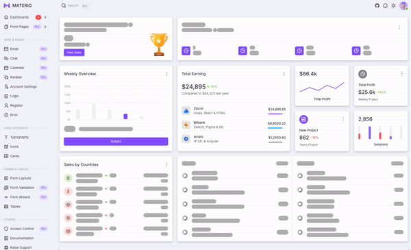

# @skeletonizer/vue
This is the Vue adapter for Skeletonizer. It provides a simple way to create skeletonized views for your Vue application.


Example app on Stackblitz [can be found here](https://stackblitz.com/edit/skeletonizer-vue-example?file=src%2Fviews%2Fdashboard%2FAnalyticsAward.vue)

## Installation
To install the package, run the following command:
`npm install @skeletonizer/vue @skeletonizer/utils --save`

`@skeletonizer/vue` is always used in conjunction with `@skeletonizer/utils`. The `@skeletonizer/utils` package provides the core functionality for creating skeletonized views, while the `@skeletonizer/vue` package provides the Vue-specific functionality. **The versions should always match**.

## main.ts
In your `main.ts` file (where you do `createApp`), you need to install the `SkeletonizerPlugin` and import the css needed for the plugin. The plugin provides the `SkeletonizerSkeleton` component and directive that will be used in your Vue components.

```typescript
import { createApp } from 'vue';
import App from './App.vue';
import { SkeletonizerPlugin } from '@skeletonizer/vue';
import '@skeletonizer/vue/dist/index.css';

createApp(App)
  .use(SkeletonizerPlugin)
  .mount('#app')
```

## Component Adjustments
Generally speaking, all you need to do to use the skeletonizer in the template, is to wrap the part of the template you wish to skeletonize in the `<skeletonizer-skeleton>` component. Additionally, you will need to pass the following to `skeletonizer-skeleton`:
- `v-slot="{ scope }"`
- `:config="skeletonizer.skeletonConfig"`
- `:show-skeleton="skeletonizer.showSkeleton"`
- `:scope="{ foo, bar }"`

All the data that you wish to access in the skeletonized part of the template must be provided in the `:scope` and accessed through the `skeletonizer.proxy(scope)` method, except the data that you provide and is available even whilst the data is being loaded (ie. `:show-skeleton="true"`). For example, if you have a `message` prop that you wish to be skeletonized, you'll need to pass it to the `:scope` object and access it through the `skeletonizer.proxy(scope).message` method.

As far as the template goes, it essentially means transforming the code from this:
```html
<div>{{ somePropOrMethodCallAvailableAsync }}</div>
<div>{{ otherAsyncProp }}</div>
<div>{{ someAlreadyHardCodedOrInputBoundPropAvailableSync }} </div>
```

into this:

```html
<skeletonizer-skeleton
    v-slot="{ scope }"
    :config="skeletonizer.skeletonConfig"
    :show-skeleton="skeletonizer.showSkeleton"
    :scope="{ somePropOrMethodCallAvailableAsync, otherAsyncProp }"
>
    <div>{{ skeletonizer.proxy(scope).somePropOrMethodCallAvailableAsync }}</div>
    <div>{{ skeletonizer.proxy(scope).otherAsyncProp }}</div>
    <div>{{ someAlreadyHardCodedOrInputBoundPropAvailableSync }} </div>
</skeletonizer-skeleton>
```

As long as the shape of the properties you access within the skeleton part of the template matches the shape of the data you provide in the `scope` and `skeletonConfig` properties, the skeletonized view will be in sync with the actual view, regardless of changes to the design.

## Usage
Every component that uses Skeletonizer should use `SkeletonizerComponentComposable`, which is available in `@skeletonizer/vue`. Both the component and the `SkeletonizerComponentComposable` are type-safe - if the shape of `schemaGenerator` returned object does not match the shape of type generic you pass to `SkeletonizerComponentComposable`, you will get a type error. You will also get an error if you fail to pass the same shape to the `:scope` input bound property of `skeletonizer-skeleton` component. While Vue has made noticeable strides in type safety, it is still lacking a bit compared to eg. Angular. Therefor, you may still need to run a `npm run type-check` command (which, in a standard vue/vite project, executes `vue-tsc --noEmit -p tsconfig.vitest.json --composite false`) if you wish to get the extra type safety.

You can use multiple separate, independently skeletonized parts within the same component. In that case, you can: 
- provide separate `:scope`, `:show-skeleton` and `:config` properties for each `skeletonizer-skeleton` component. For easier maintenance, it is still recommended that you prefix (or suffix) all of the referenced composables with `skeletonizer` (eg. `profileSkeletonizer`, or `skeletonizerUsersList`) to make it clear that they are part of the skeletonized view. In that case, you should obviously access each `.proxy` method with the corresponding composables (eg. `profileSkeletonizer.proxy(scope)`).
- provide the same `:scope` and `:config` property to all `skeletonizer-skeleton` components, with separate `:show-skeleton` properties for each `skeletonizer-skeleton` component.

In the skeletonized part of the template, you **must** access the data through the `skeletonizerFoo.proxy(scope)` method.
You can think of `skeletonizerFoo.proxy(scope)` in the same way as you would think of `this` in a class method. The only difference is that when using `skeletonizerFoo.proxy(scope)`, the content-projected template will use the mocked values when the `showSkeleton` is `true`, and resolved values when `showSkeleton` is `false` - all while maintaining the type safety.

For more details about the `SchemaItem` property, see the [SchemaItem](/packages/utils/README.md#schemaitem) section.

For more details about the `skeletonConfig` property, see the [TSchemaConfig](/packages/utils/README.md#tschemaconfig) section.


```typescript
// <script setup lang="ts">
import { SkeletonizerComponentComposable, SkeletonizerSkeleton } from '@skeletonizer/vue';
import { SchemaItem } from '@skeletonizer/utils';
import { type Ref, ref } from 'vue';
import assetImgUrl from '@/assets/logo.svg';

interface IResource {
  title: string;
  link: string;
  svg: string;
}

// the svgs are just for the sake of the example
const supportSvg: string = `
<svg xmlns="http://www.w3.org/2000/svg" width="20" height="20" fill="currentColor">
    <path
      d="M10 3.22l-.61-.6a5.5 5.5 0 0 0-7.666.105 5.5 5.5 0 0 0-.114 7.665L10 18.78l8.39-8.4a5.5 5.5 0 0 0-.114-7.665 5.5 5.5 0 0 0-7.666-.105l-.61.61z"
    />
  </svg>
`;

const loadingSvg: string = '<svg width="24" height="24" viewBox="0 0 24 24" xmlns="http://www.w3.org/2000/svg"><style>.spinner{transform-origin:center;animation:spinner .75s linear infinite}@keyframes spinner{from{transform:rotate(0deg)}to{transform:rotate(360deg)}}</style><g class="spinner"><circle cx="12" cy="2.5" r="1.5" opacity=".14"/><circle cx="16.75" cy="3.77" r="1.5" opacity=".29"/><circle cx="20.23" cy="7.25" r="1.5" opacity=".43"/><circle cx="21.50" cy="12.00" r="1.5" opacity=".57"/><circle cx="20.23" cy="16.75" r="1.5" opacity=".71"/><circle cx="16.75" cy="20.23" r="1.5" opacity=".86"/><circle cx="12" cy="21.5" r="1.5"/></g></svg>';

const pageTitle: string = 'Some prop that we do not wish to skeletonize, but wish to use in the view nonetheless';
const message: Ref<string> = ref('vue');
const resources: Ref<IResource[]> = ref([]);

type TSkeletonized = { message: string, resources: IResource[] };

// if you call this const eg. `skeletonizerFoo`, you should access the skeletonized props in the template with `skeletonizerFoo.proxy(scope).someProp`
// if you need multiple separate skeletonized parts, you should create multiple separate composables using `SkeletonizerComponentComposable.generate` and provide separate `:scope`, `:show-skeleton` and `:config` properties for each `skeletonizer-skeleton` component. 
const skeletonizer: SkeletonizerComponentComposable<TSkeletonized> = SkeletonizerComponentComposable.generate<TSkeletonized>(
  {
    repeat: 3,
    schemaGenerator: () => ({
      message: new SchemaItem().words(5),
      resources: Array.from({ length: 3 }, () => ({
        title: new SchemaItem().words(2),
        link: new SchemaItem().identical('https://vuejs.org/'),
        svg: new SchemaItem().identical(loadingSvg),
      }))
    }),
  },
  true,
);

setTimeout(() => {
  message.value = 'Async update of message';

  resources.value = [
    { title: 'Vue', link: 'https://vuejs.org/', svg: assetImgUrl },
    { title: 'Vite', link: 'https://vitejs.dev/', svg: supportSvg },
  ];

  skeletonizer.showSkeleton = false;
}, 5000 * Math.random());

// </script>
```

### Color Scheme
Generally speaking, you shouldn't need to adjust the color scheme of the skeletonized component in most cases. However, should you need to, the color scheme of the skeletonized views can be customized by providing the `:color-schema` property to the `<skeletonizer-skeleton>`.

For more details about the `:color-schema` property, see the [colorSchema](/packages/utils/README.md#colorschema) section.


## Contributing
For Vue adapter-specific contributions, run the following commands to get started:
- `npm install`
- adjust the code in the `packages/vue` directory
- adjust the code in the `packages/vue/src/showcase` directory to make sure the changes can easily be seen in the example app
- `npm run dev` in the `packages/vue` directory to start the example app
- update readme file in the `packages/vue` directory

Before submitting a pull request, make sure to run the following commands in `packages/vue` directory:
- `npm run lint`
- `npm run type-check`
- `npm run coverage`
- `npm run build`
